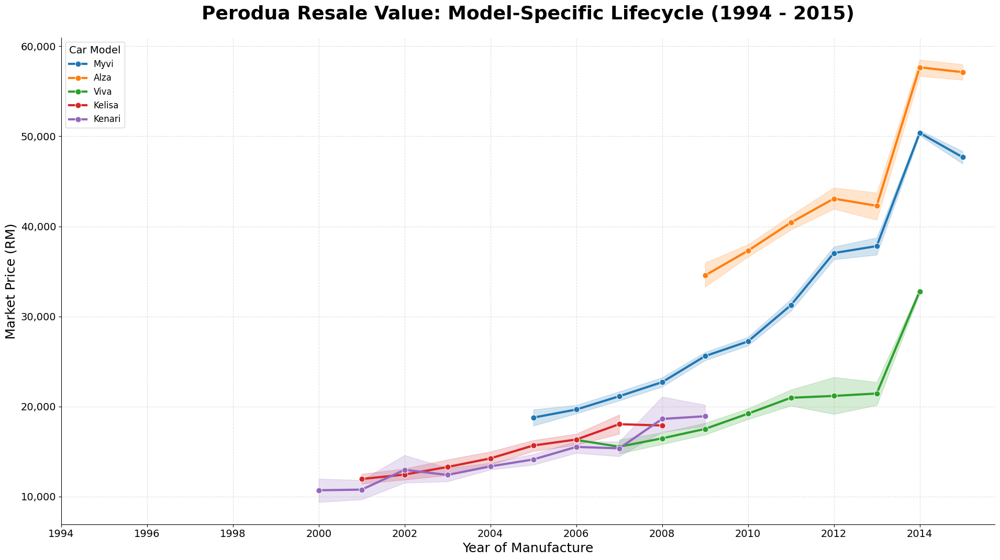
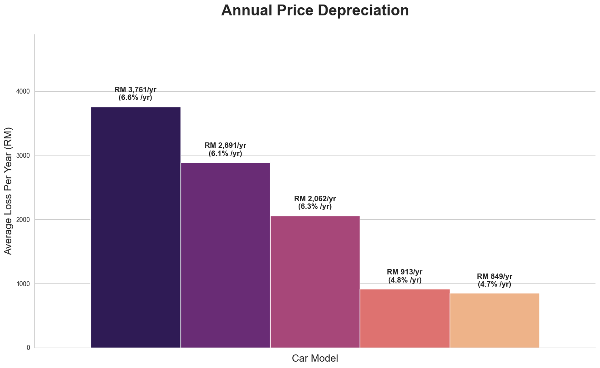
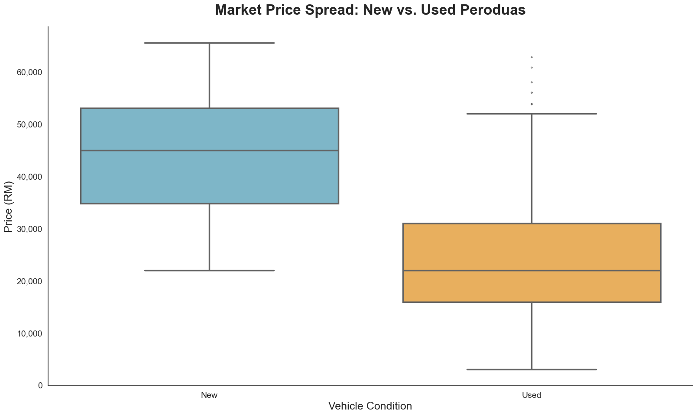

# Perodua Price Depreciation Analysis (Malaysia)

## Objective
To extract, clean, and analyze historical market data for Perodua vehicles (1994–2015) to uncover actionable insights regarding resale value retention, model-specific depreciation rates, and lifecycle price floors in the Malaysian automotive market.

## Tech Stack
* **Database:** MySQL (Relational schema design, data cleaning, and structured storage)
* **Programming:** Python
* **Libraries:** * `SQLAlchemy` & `PyMySQL` (Database connection & ORM)
  * `Pandas` (Data manipulation & model segmentation)
  * `Matplotlib` & `Seaborn` (High-fidelity statistical visualization)
  * `python-dotenv` (Secure environment variable management)

## Dataset Details & ETL Process
* **Raw Data:** Over 5,900 unique used car listings spanning a 20-year history.
* **Source:** *Scraped from Malaysian automotive classified platforms*
* **The Challenge:** The raw data contained inconsistent model naming, missing manufacture years, and extreme price outliers that skewed market averages. Furthermore, grouping all cars together created a severe "Aggregation Bias."
* **The Solution (ETL):** I built a custom Python ETL pipeline to normalize model names and filter historical boundaries. I resolved the aggregation bias by querying the MySQL database to segment the data by specific models (Alza, Myvi, Viva, etc.), allowing for the calculation of true, isolated depreciation trajectories.

## Key Business Insights
1. **The Depreciation Leader:** The Perodua Alza sees the highest annual cash drop (~RM 3,761/year) due to its premium initial purchase price, though it maintains strong percentage retention.
2. **The "Price Floor" Phenomenon:** Legacy models like the Kelisa and Kenari have officially bottomed out in value, depreciating at less than 5% annually, making them high-utility "zero-loss" assets.
3. **The Stability Benchmark:** The Perodua Myvi remains the gold standard for market stability, showing a remarkably consistent ~6% annual depreciation over a 10-year lifespan gap.

## Visualizations

### 1. Model-Specific Price Trends

### 2. Annual Value Depreciation

### 3. Market Price Distribution

